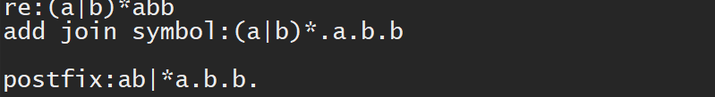

# RE2NFA2DFA2MFA
1. Use Thompson algorithm to convert the regular expression to NFA  
2. Use the subset construct to convert NFA to DFA  
3. Minimize DFA to MFA  
4. Use MFA to match strings

# How to run
src\main\test.java is the test funnciton.

# Introduce
## 1. RE2NFA
+ `NFA nfa = new NFA(re);`

Creat a NFA by Thompson algorithm
***
+ `nfa.add_join_symbol();`

Add join symbol between regular expression  
**The join symbol is '.'**  
for example:
```
    re = "(a|bc)*d";
    re_add_join_symbol = "(a|b.c)*.d" ；
```
***

+ `nfa.postfix();`  
Converts an infix expression to a postfix expression
for example:
```
    re_add_join_symbol = "(a|b.c)*.d"；
    re_postfix = "abc.|*d."
```
***

+ `nfa.re2nfa();`  
Using Thompson algorithm constructs NFA
***

+ `nfa.print();`  
Print out NFA (depth-first traversal)   
***
 
