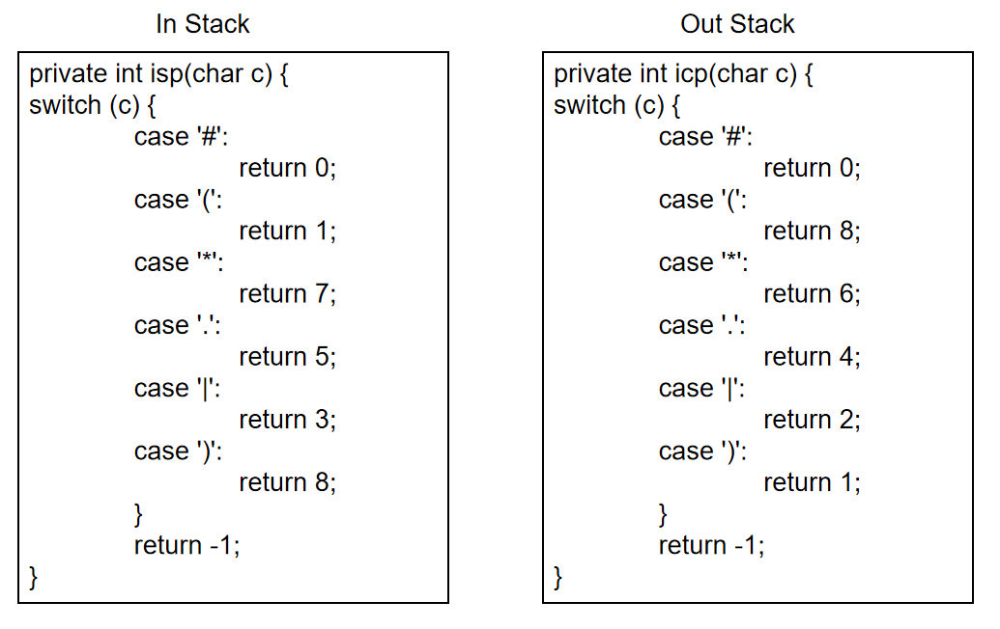
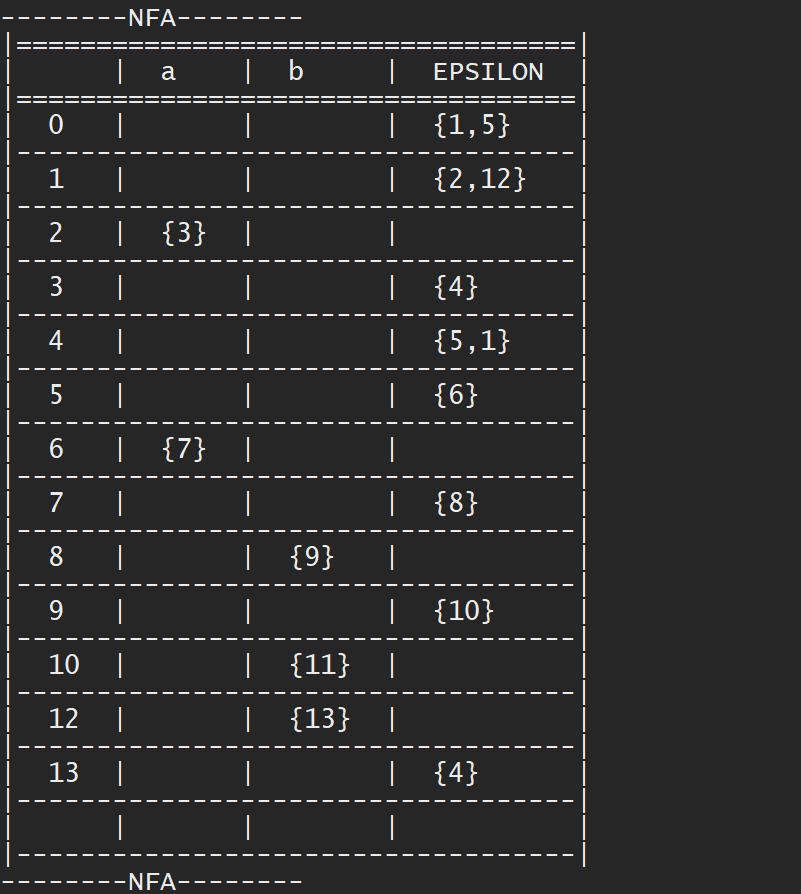
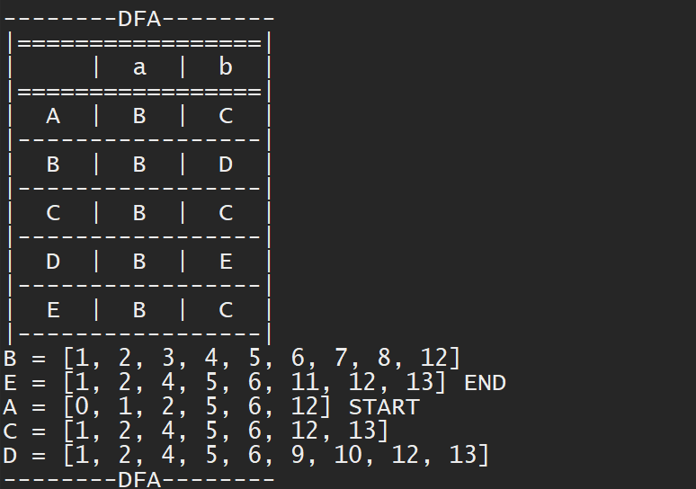
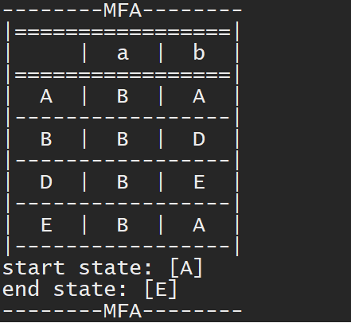
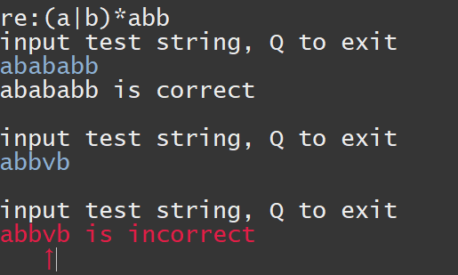

# RE2NFA2DFA2MFA
1. Use Thompson algorithm to convert the regular expression to NFA  
2. Use the subset construct to convert NFA to DFA  
3. Minimize DFA to MFA  
4. Use MFA to match strings

# How to run
src\main\test.java is the main funnciton.

# Attention
Use an equal width font, otherwise the output table will not be aligned

# Details
## 1. RE2NFA
+ `NFA nfa = new NFA(re);`

Creat a NFA by Thompson algorithm
___
+ `nfa.add_join_symbol();`

Add join symbol between regular expression  
**The join symbol is '.'**  
for example:
```
    re = "(a|bc)*d";
    re_add_join_symbol = "(a|b.c)*.d" ；
```
___

+ `nfa.postfix();`  
Converts an infix expression to a postfix expression
for example:
```
    re_add_join_symbol = "(a|b.c)*.d"；
    re_postfix = "abc.|*d."
```
 
***

+ `nfa.re2nfa();`  
Using Thompson algorithm constructs NFA
***

+ `nfa.print();`  
Print out NFA (depth-first traversal)   
***
 
 

## 2. NFA2DFA
+ `DFA dfa = new DFA(nfa.getPair(),nfa.getLetter());`  
`dfa.createDFA();`  
Construct the DFA using the subset construct
___
+ `dfa.printDFA();`  
 

## 3. DFA2MFA
+ `MFA mfa = new MFA(dfa.getDFA(),dfa.getEndState(),dfa.getLetter());`    
`mfa.minimize();`  
Creat a  MFA  
___

+  `mfa.merge();`   
merge
___

+  `mfa.printMFA();`   
 

## 4. Match
 


